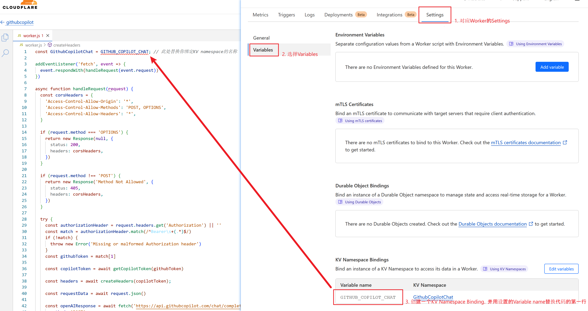

# cf-copilot-service

> ⚠️ **警示**：根据部分用户反馈，使用本项目可能存在封号的风险，暂时不明确具体原因。请在使用前仔细考虑潜在后果，并谨慎行事，注意隔离风险。
 
这是一个将兼容OpenAI API的会话请求转发到Github Copilot Chat API的Cloudflare Worker脚本，模型参数仅支持`gpt-4`和`gpt-3.5-turbo`，实测使用其他模型均会以默认的3.5处理（对比OpenAI API的返回结果，猜测应该是最早的版本`gpt-4-0314`和`gpt-3.5-turbo-0301`）

## 使用方法

1. 你需要拥有一个有Github Copilot权限的Github账户

2. 获取你的Token，[参考这里](https://github.com/aaamoon/copilot-gpt4-service#%E8%8E%B7%E5%8F%96-copilot-token)

3. 创建一个Cloudflare Worker

4. 创建一个KV容器

5. 将KV容器绑定到Worker中（可以在Settings -> Variables下找到）

6. 修改代码第一行的`GITHUB_COPILOT_CHAT`为你绑定KV namespace时使用的变量名称
   

   中文界面参考[Issue#1](https://github.com/wpv-chan/cf-copilot-service/issues/1#issue-2060623133)

7. 将[cf_copilot_service.js](./cf_copilot_service.js)中的内容粘贴到Worker编辑器页面中

8. 保存并部署Worker

9.  打开任意支持自定义OpenAI Endpoint的前端应用

10. 设置Endpoint为你的Worker地址，key为第2步中的Token

11. 设置完成

## 致谢

https://github.com/aaamoon/copilot-gpt4-service